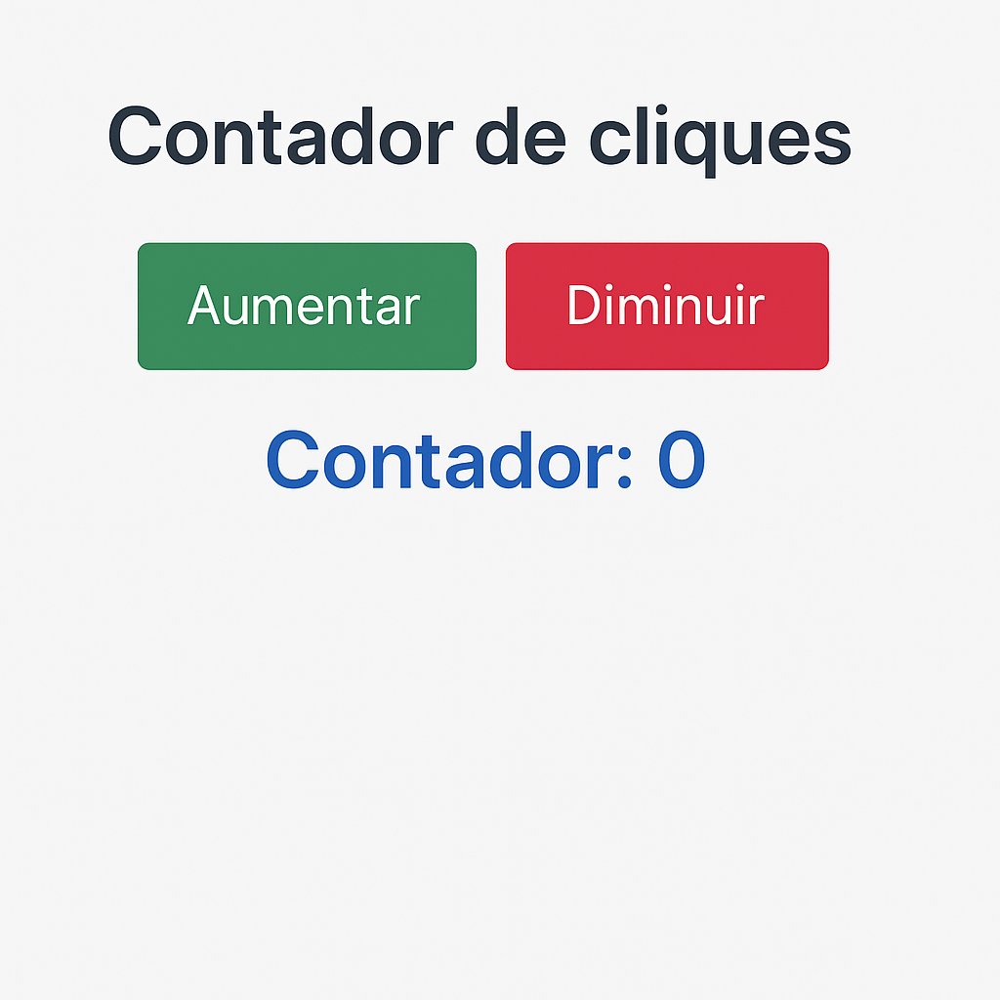

# 🧮 Projeto: Contador JS

Este é um projeto simples de contador feito com **HTML**, **CSS** e **JavaScript**, desenvolvido como exercício prático para reforçar os conceitos de manipulação do DOM e eventos.

## 💡 Funcionalidades

- ✅ Contar cliques com botões de **aumentar** e **diminuir**
- ✅ Exibição dinâmica do valor atualizado na tela
- ✅ Estilo responsivo e amigável com CSS puro
- ✅ Uso de `addEventListener` para aplicar lógica de eventos via JavaScript

## 📸 Prévia

 <!-- opcional: coloque uma imagem se quiser -->

## 🛠️ Tecnologias utilizadas

- HTML5
- CSS3
- JavaScript (puro)

## 📂 Como usar

1. Clone ou baixe o repositório
2. Abra o arquivo `index.html` em seu navegador
3. Clique nos botões e veja a mágica acontecer ✨

## ✨ Resultado

Você pode testar o projeto ao vivo com o GitHub Pages:  
🔗 [Clique aqui para ver online](https://valdemar100.github.io/contador-js/)

## 📚 Aprendizados

Este projeto ajudou a reforçar:
- Seleção de elementos com `querySelector`
- Manipulação de conteúdo com `innerHTML`
- Eventos de clique com `addEventListener`
- Estruturação e estilização com HTML + CSS

---

Feito com 💻 e vontade de aprender por [@valdemar100](https://github.com/valdemar100)
